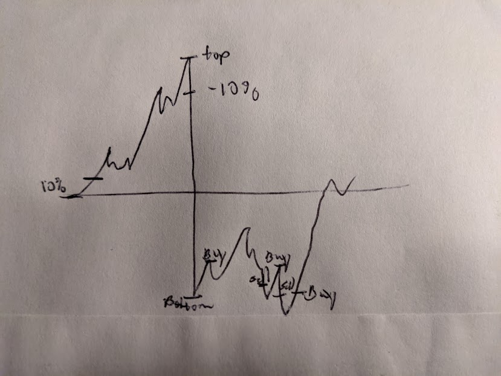

# mETF

mETF (Working title) is a way for you to invest using a bullish elastic strategy.

# DISCLAIMER

*Past Performance Is No Guarantee of Future Results*

We are not responsible ultimately for any trades or loss of money on your account. Using this application assumes the risk, including any defects or issues that may arise, as a result of using this application.

Good luck!

## What is mETF?

mETF utilizes a bullish stop limit strategy. What that means is that at a certain part around the beginning of the day, the stock will analyze the current price of a particular stock. Once the stock shows a percentage increase it will place an order. The stock will then transition into a stop limit sell strategy, where the price needs to either (whichever is greater):

* needs to fall down a certain percentage, or
* needs to fall back to around the original buy price

After a sell occurs, the tracker will reset and perform the same on the next bullish movement if it satisfies requirements.

## Requirements

You must have day trades available in order to use this account.

This application current trades on Robinhood, so a personal account is necessary.